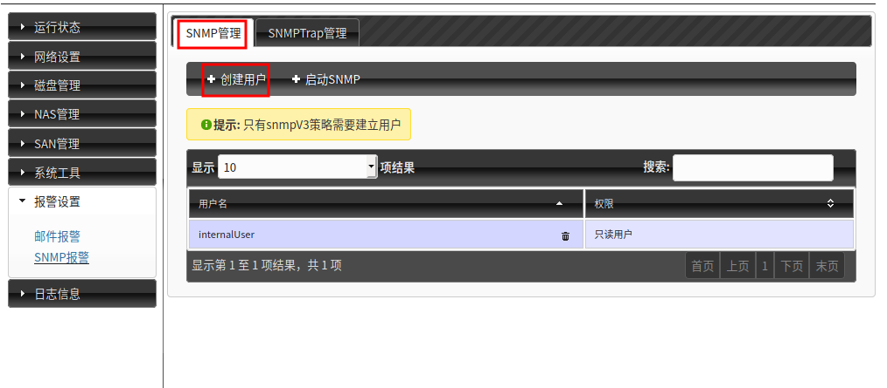
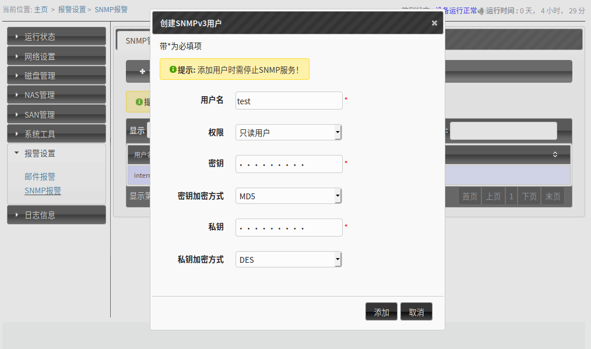
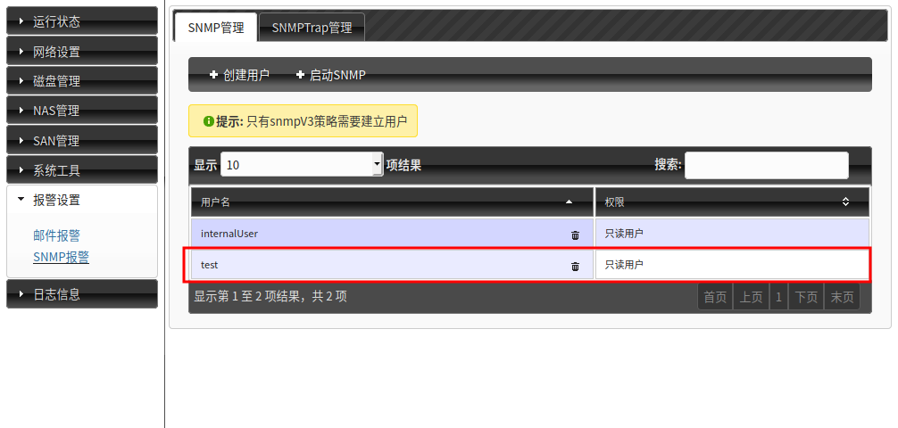
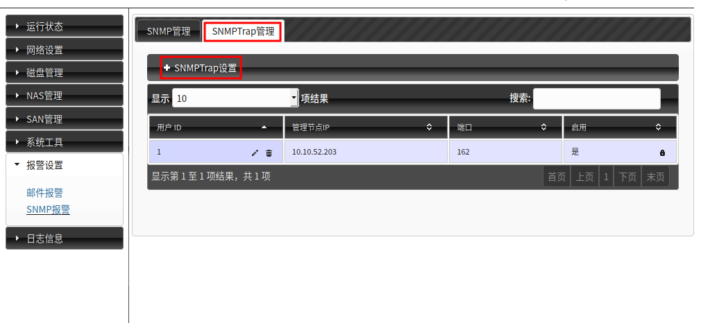
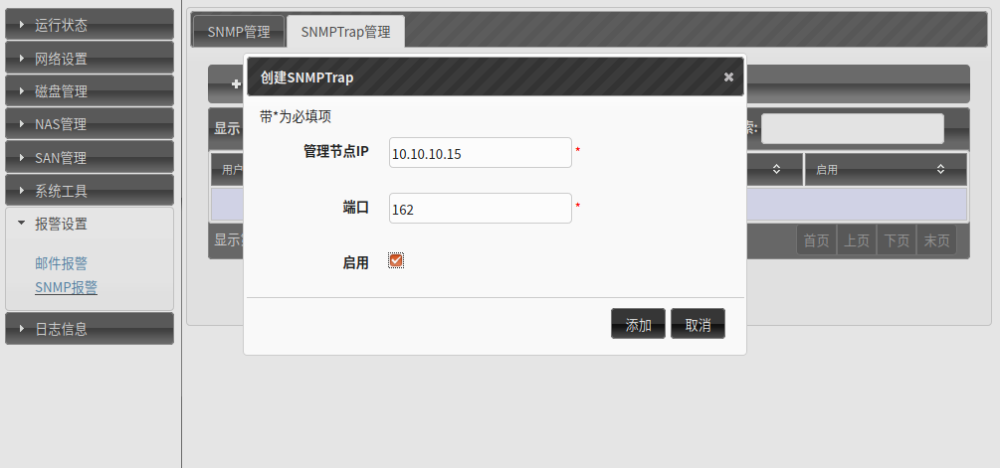
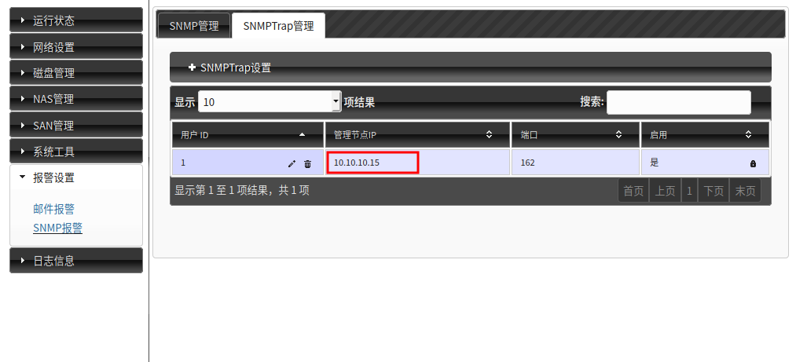

# ODSP SNMP功能模块介绍
[TOC]

鲸鲨存储支持标准的snmp网管协议，提供MIB管理信息库及OID接口，能通过OID获取设备实时有效的状态信息，方便用户实现信息系统的统一网管工作。

SNMP协议对外提供了三种用于控制MIB对象的基本操作命令。它们是：Get、Set 和 Trap。

1. Get：管理站读取代理者处对象的值。它是SNMP协议中使用率最高的一个命令，因为该命令是从网络设备中获得管理信息的基本方式。
2. Set：管理站设置代理者处对象的值。它是一个特权命令，因为可以通过它来改动设备的配置或控制设备的运转状态。它可以设置设备的名称，关掉一个端口或清除一个地址解析表中的项等。
3. Trap：代理者主动向管理站通报重要事件。它的功能就是在网络管理系统没有明确要求的前提下，由管理代理通知网络管理系统有一些特别的情况或问题发生了。如果发生意外情况，客户会向服务器的162端口发送一个消息，告知服务器指定的变量值发生了变化。通常由服务器请求而获得的数据由服务器的161 端口接收。Trap 消息可以用来通知管理站线路的故障、连接的终端和恢复、认证失败等消息。管理站可相应的作出处理。

## 1 GET mibs库与OID的对应关系
|OID|说明|mibs|
|----------------------|----------------|----------------|
|                      |其他库所依赖的库|HACKING-SNMP-MIB|
|1.3.6.1.4.1.38696.2.1 |获取磁盘信息    |SMARTCTL-MIB    |
|1.3.6.1.4.1.38696.2.2 |获取RAID信息    |MD-RAID-MIB     |
|1.3.6.1.4.1.38696.2.5 |获取存储池使用率|STORPOOL-MIB    |
|1.3.6.1.4.1.38696.2.6 |获取网络接口状态|INTERFACE-MIB   |
|1.3.6.1.4.1.38696.2.12|获取FC状态信息  |FCNOTIFY-MIB    |

## 2 GET mibs库消息格式
### 2.1 SMARTCTL-MIB
|编号|字段名|值类型|说明|
|----|------|------|----|
|1   |smartCtlDeviceIndex       |Integer32    |序号|
|2	 |smartCtlDeviceDev         |DisplayString|磁盘名称|
|3	 |smartCtlDeviceModelFamily |DisplayString|磁盘厂商|
|4	 |smartCtlDeviceDeviceModel |DisplayString|磁盘型号|
|5	 |smartCtlDeviceSerialNumber|DisplayString|磁盘序列号|
|6	 |smartCtlDeviceUserCapacity|DisplayString|磁盘容量|
|7	 |smartCtlDeviceATAVersion  |DisplayString|ATA版本号|
|8	 |smartCtlDeviceHealthOK    |TruthValue	  |健康状态|
|9	 |smartCtlDeviceTemperatureCelsius  |Gauge32|磁盘温度|
|10	 |smartCtlDeviceReallocatedSectorCt |Gauge32|重映射扇区计数|
|11	 |smartCtlDeviceCurrentPendingSector|Gauge32|当前待映射的扇区数|
|12	 |smartCtlDeviceOfflineUncorrectable|Gauge32|脱机无法矫正的扇区数|
|13	 |smartCtlDeviceUDMACRCErrorCount   |Gauge32|接口通信错误计数|
|14	 |smartCtlDeviceReadErrorRate       |Gauge32|底层读取错误率|
|15	 |smartCtlDeviceSeekErrorRate       |Gauge32|寻道错误率|
|16  |smartCtlDeviceHardwareECCRecovered|Gauge32|硬件错误检查和纠正的恢复次数|

### 2.2 MD-RAID-MIB
|编号|字段名|值类型|说明|
|----|------|------|----|
|1	 |mdRaidArrayIndex     |Integer32    |序号     |
|2	 |mdRaidArrayDev       |DisplayString|RAID名称 |
|3	 |mdRaidArrayVersion   |DisplayString|版本号   |
|4	 |mdRaidArrayUUID	   |DisplayString|RAID UUID|
|5	 |mdRaidArrayLevel	   |DisplayString|RAID级别 |
|6	 |mdRaidArrayLayout	   |DisplayString|N/A      |
|7	 |mdRaidArrayChunkSize |DisplayString|块大小   |
|8	 |mdRaidArraySize      |DisplayString|RAID大小 |
|9	 |mdRaidArrayDeviceSize|DisplayString|RAID单盘使用空间|
|10	 |mdRaidArrayHealthOK  |TruthValue   |RAID健康状态|
|11	 |mdRaidArrayHasFailedComponents|TruthValue|RAID中是否有坏盘|
|12	 |mdRaidArrayHasAvailableSpares	|TruthValue|是否有热备盘|
|13	 |mdRaidArrayTotalComponents    |Gauge32   |总盘数|
|14	 |mdRaidArrayActiveComponents   |Gauge32   |激活的盘数|
|15	 |mdRaidArrayWorkingComponents  |Gauge32   |工作中的盘数|
|16	 |mdRaidArrayFailedComponents   |Gauge32   |损坏的盘数|
|17	 |mdRaidArraySpareComponents    |Gauge32   |热备盘数|

### 2.3 STORPOOLUSED-MIB
|编号|字段名|值类型|说明|
|----|------|------|----|
|1	 |StorpoolUsedIndex|Integer32	 |序号        |
|2	 |StorpoolUsedName |DisplayString|存储池名称  |
|3	 |StorpoolUsedUsed |DisplayString|存储池使用率|

### 2.4 INTERFACESTATE-MIB
|编号|字段名|值类型|说明|
|----|------|------|----|
|1	 |InterfaceIndex|Integer32	  |序号|
|2	 |InterfaceName |DisplayString|网口名称|
|3	 |InterfaceMode |DisplayString|网口模式|
|4	 |InterfaceLink |DisplayString|网口连接状态|
|5	 |InterfaceUp   |DisplayString|网口开机启动状态|

### 2.5 FCNOTIFY-MIB
|编号|字段名|值类型|说明|
|----|------|------|----|
|1 	 |FCNotifyIndex|Integer32	 |序号|
|2	 |FCName	   |DisplayString|光纤卡名称|
|3	 |FCState      |DisplayString|光纤卡状态|
|4	 |FCSpeed	   |DisplayString|光纤卡速率|

## 3 SNMP GET测试
基于snmpv2协议 ：
```bash
snmpwalk -c public -v 2c IPAddress OID
```
**-c**：团体名(Community Name)l
**-v**：表示其snmp的协议版本，此为snmp v2c版本
**IPAddress**：snmp代理地址
**OID**：管理对象的OID(Object Identifier)
基于snmpv3协议：
```bash
snmpwalk -v 3 -u username4snmpv3 -l authNoPriv -a MD5 -A rootsrockreggae IPAddress OID
```
**-v**：表示其snmp的协议版本，此为snmp v3版本
**-u**：表示snmp v3用户名
**-l**：表示使用身份认证，authNoPriv表示不加密
**-a**：使用MD5加密数据流
**-A**：密码
**IPAddress**：snmp代理地址
**OID**：管理对象的OID(Object Identifier)

snmp v3安全级别有三种，分别为noAuthNoPriv（不认证也不加密）、authNoPriv（认证但是不加密）、authPriv（既认证又加密）

## 4 TRAP mibs库与OID的对应关系
|OID|说明|mibs|
|----------------------|----------------|----------------|
|1.3.6.1.4.1.38696.2.3 |获取磁盘信息    |SMARTCTL-MIB    |
|1.3.6.1.4.1.38696.2.4 |获取RAID信息    |MD-RAID-MIB     |

## 5 TRAP mibs库消息格式
### 5.1 DISKWARNING-MIB
|编号|字段名|值类型|说明|
|----|------|------|----|
|1	 |DiskWarningDiskIndex   |Integer32    |序号|
|2	 |DiskWarningDiskName    |DisplayString|磁盘名称（sdd）|
|3	 |DiskWarningDiskId	     |DisplayString|磁盘对应ID|
|4	 |DiskWarningDiskPath    |DisplayString|磁盘路径（/dev/sdd）|
|5	 |DiskWarningDiskState   |DisplayString|磁盘状态|
|6	 |DiskWarningDiskErrLevel|DisplayString|错误级别|

### 5.2 RAIDWARNING-MIB
|编号|字段名|值类型|说明|
|----|------|------|----|
|1	 |RaidWarningRaidIndex   |Integer32	   |序号|
|2	 |RaidWarningRaidName    |DisplayString|raid名称（RAID1）|
|3	 |RaidWarningRaidPath	 |DisplayString|raid路径（/dev/md10）|
|4	 |RaidWarningRaidErrType |DisplayString|raid错误类型（警告/错误）|
|5	 |RaidWarningRaidErrLevel|DisplayString|raid错误级别（警告1/错误2）|

## 6 SNMP TRAP测试
snmp代理地址：10.10.66.199
snmp管理地址：10.10.66.188
步骤如下：
1. SSH登陆到管理地址 **10.10.66.188**，编辑 **/etc/snmp/snmptrapd.conf**，加入如下内容：
```bash
authcommunity execute,log,net hacking
```
2. 执行如下命令启动 **snmptrap**监听：
```bash
snmptrapd -d -f -Lo
```
3. 在 **10.10.66.199 ** 拔盘，或使用命令踢盘，查看 **10.10.66.188 **上snmptrapd的输出。

## 7 界面配置
### 7.1 SNMP用户管理

**Tip**：只有SNMP V3协议需要建立用户。

选择“SNMP管理”选项页，点击“创建用户”按钮创建SNMP V3用户。



在弹出的“创建SNMPv3用户”对话框里按提示填写相关内容，点击“添加”提交。



创建成功后列表会列出新创建的用户。



### 7.2 SNMP Trap配置
选择“SNMPTrap管理”选项页，点击“SNMPTrap设置”按钮打开SNMPTrap设置界面。



在弹出的“创建SNMPTrap”对话框里按提示填写相关内容，点击“添加”提交。



创建成功后列表会列出新创建的管理地址。



**Tips**：添加是**SNMP**管理地址，当磁盘或RAID出现异常时，会触发Trap发送信息到该地址。
