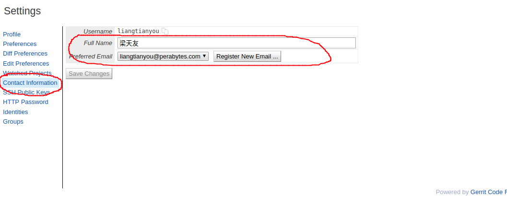
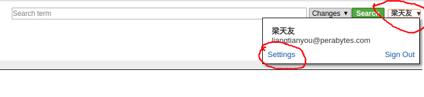
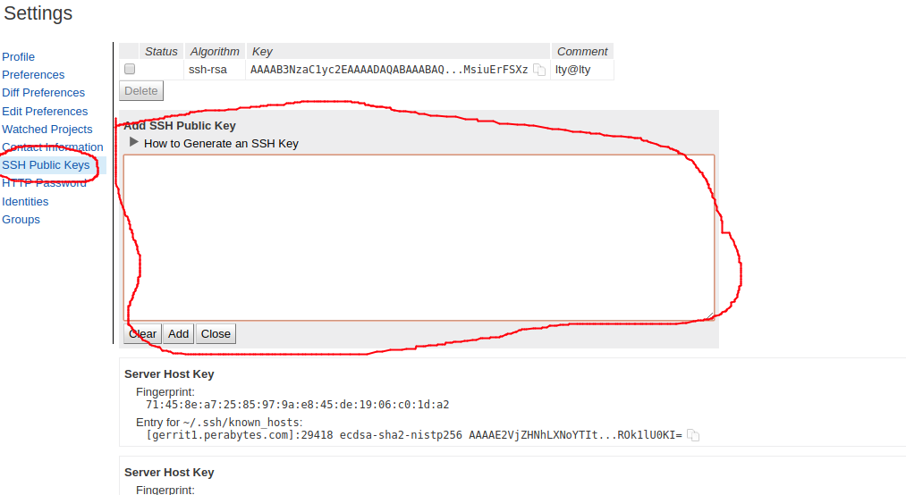
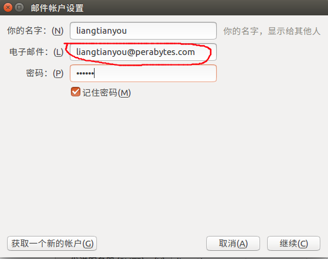
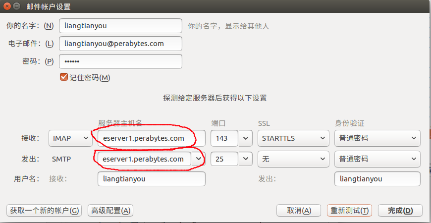
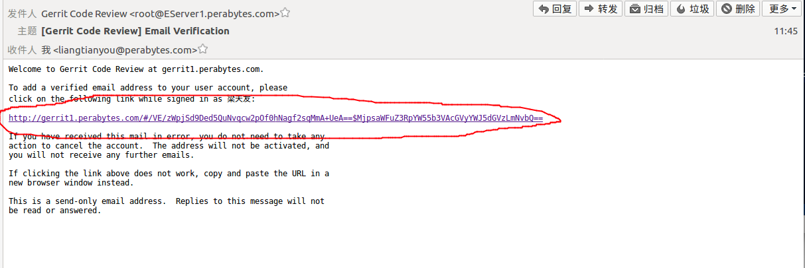
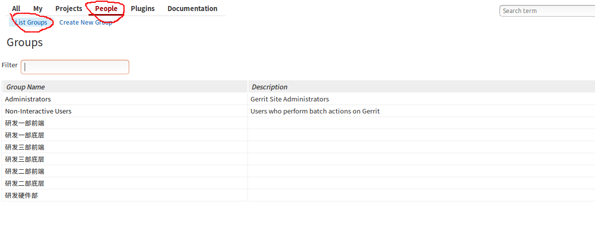
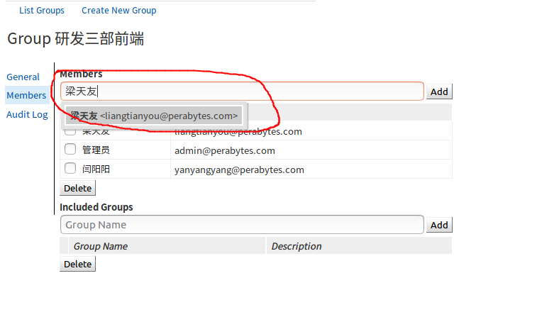
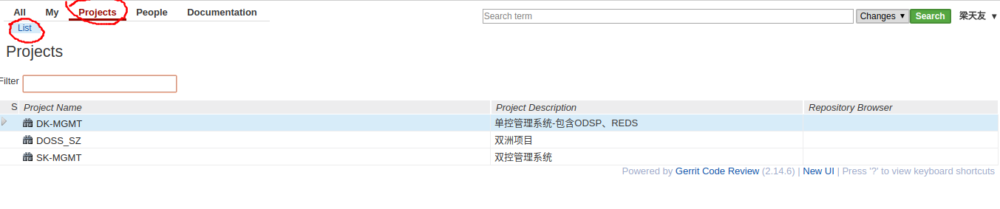
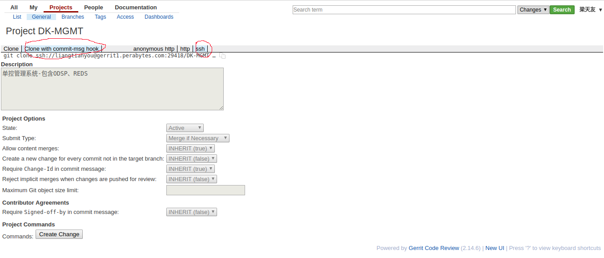

# Gerrit客户端使用说明
[TOC]
## 登录WEB管理界面
WEB管理界面地址

1. IP地址：10.10.1.21
2. 网址：http://10.10.1.21:880

因为gerrit需要通过邮件来激活用户，发送通知等。1.21没有外网访问权限，所以在本地搭建了邮件服务，需要手动修改hosts文件来增加邮件服务器地址来进行域名解析。

1. Linux系统修改/etc/hosts，添加如下内容：

    10.10.1.21      EServer1.perabytes.com
  
2. Windows系统修改C:\Windows\system32\drivers\etc\hosts，添加如下内容：

    10.10.1.21      EServer1.perabytes.com

在浏览器输入 [http://10.10.1.21:880](http://10.10.1.21:880) 访问gerrit平台。

1. 用户名为名称的全拼。
2. 密码查看邮件，各自分配密码不同，如果忘记密码，可以找我重置密码。

## 用户注册
进入后要求配置"Full Name"及"Register Email"

1. Full Name输入中文全名。
2. Register Email输入格式如下：XXX@perabytes.com # XXX为名称全拼
  

## 上传公钥
1. 点击右侧上方用户名，选择"Settings"，进入设置界面。
  
2. 选择左侧菜单"SSH Public Keys"，把公钥内容粘贴并添加。
  

## 配置邮箱地址
新的gerrit平台使用本地搭建的邮件服务器（EServer1.peraabytes.com），所以需要在本地邮箱客户端添加一个新的邮箱地址。

1. 邮箱地址：XXX@perabytes.com # XXX为名称全拼
2. 邮箱密码：同gerrit密码。
3. SMTP及POP地址：eserver1.perabytes.com。

  
  

邮箱地址添加成功后会收到gerrit的验证邮件，点击邮件里的连接完成验证。

## 管理员分配权限
选择"People"->"List Groups"，进入用户/组管理页面，选择对应的组。

将新用户加入对应的组。

## 下载代码
权限分配完成后，用户可以检出代码。
选择"Projects"->"List"，进入项目管理页面，选择要检出的项目。

点击选择“Clone with commit-msg hook”及“ssh”，生成检出链接。

## 客户端配置
1. 配置邮箱地址：git config --global user.email XXX@perabytes.com # XXX为名称全拼
2. 配置提交地址：git config remote.origin.push refs/heads/\*:refs/for/\*

## 修改及提交代码
修改代码后进行提交

1. git add xxx # 添加修改
2. git commit -m '备注内容' # 提交修改
3. git push # 提交到远端
