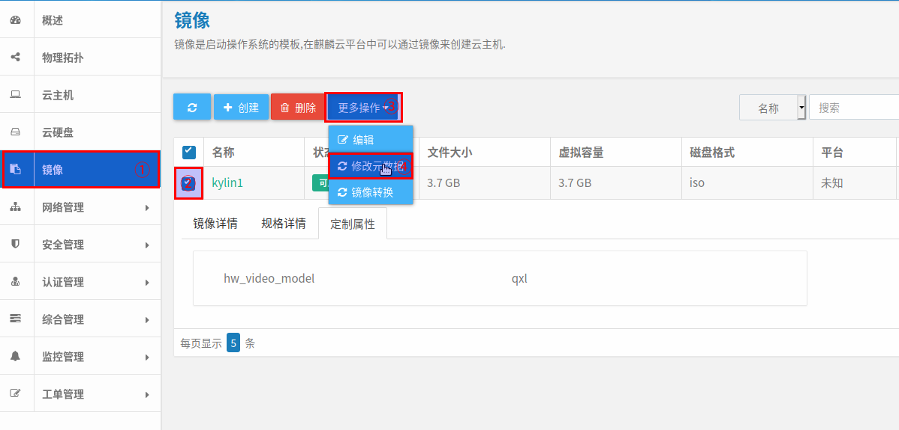

[TOC]

## 1 环境
双控版本：REDS-3.3-24
麒麟云：基于 openstack M 版本
计算节点：5个，主机名 compute1-5
控制节点：3个，主机名 controller1-3

1. openstack部署方式：docker模式，通过 kolla 部署。 
2. 每个节点都部署了cinder服务（存储服务）。
3. 麒麟云并**不稳定**，某些服务会不时宕机。

## 2 驱动部署
### 2.1 拷贝驱动
将驱动目录 ```estor``` 拷贝到到 ```cinder``` 服务驱动部署目录
```bash
docker cp estor cinder_volume:/usr/lib/python2.7/site-packages/cinder/volume/drivers/
```

### 2.2 配置驱动
配置文件：```/etc/kolla/cinder-volume/cinder.conf```
增加如下内容：
```bash
[estorip]
volume_driver = cinder.volume.drivers.estor.estor_iscsi.EstorIscsiDriver
san_ip = 10.22.11.44,10.22.11.45
san_login = superuser
san_password = p@ssw0rd
volume_group = StorPool11
volume_backend_name = estorip
```
键值对说明：
|键|值|说明|
|--|--|--|
|volume_driver|cinder.volume.drivers.estor.estor_iscsi.EstorIscsiDriver|驱动引用路径|
|san_ip|10.22.11.44,10.22.11.45|存储控制器的IP地址。**顺序**和**存储池**关联，存储池在哪个控制器，哪个控制器的IP在前|
|san_login|superuser|用户和密码。没用，唬人的|
|san_password|p@ssw0rd||
|volume_group|StorPool11|存储池名称|
|volume_backend_name|estorip|创建cinder类型时使用|

在 **[DEFAULT]** 项启用驱动
在enabled_backends里加入添加的项 **[estorip]**
```bash
[DEFAULT]
...
enabled_backends = cinder-volumes, estorip
...
```
### 2.3 创建cinder类型

变量说明：
|变量|说明|
|--|--|
|type-name|类型名称|
|volume_backend_name|类型对应的驱动名称，指向配置文件里的 volume_backend_name|

```bash
cinder type-create <type-name>
cinder type-key <type-name> set volume_backend_name=<volume_backend_name>
```

**注意**: ```=``` 号两端不能加空格。

例如： 
|变量|值|
|--|--|
|type-name|estor-iscsi|
|volume_backend_name|estorip|

执行命令如下：
```bash
cinder type-create estor-iscsi
cinder type-key estor-iscsi set volume_backend_name = estorip
```

### 2.4 重启cinder服务
```bash
docker restart cinder_volume
```

### 2.5 查看cinder服务
这里的 ```openrc.sh``` 可能在实际环境中不同，是为了获取认证。
```bash
source admin-openrc.sh
cinder service-list
```

### 2.6 麒麟云界面设置
登录麒麟云，点击右上角的“admin”，在弹出菜单选择“系统设置”。


在“系统设置”界面，将“启用云硬盘类型”开关打开。


## 3 调试相关
日志路径：```/var/lib/docker/volumes/kolla_logs/_data/```
### 3.1 cinder日志
路径：```/var/lib/docker/volumes/kolla_logs/_data/cinder/cinder-volume.log```

### 3.2 nova日志
路径：```/var/lib/docker/volumes/kolla_logs/_data/nova/nova-compute.log```

### 3.3 云硬盘状态修改
麒麟云会出现磁盘状态不一致情况，比如：云主机已删除，但磁盘状态未释放。
通过下面命令更新磁盘状态为 **未使用** 和 **已卸载**。
<volume-id> 可以通过 ```cinder list``` 命令查看。
```bash
cinder reset-state --state avaliable --attach-status detached <volume_id>
```

## 4 存在问题
### 4.1 热迁移问题
**问题描述**：

虚机热迁移功能始终不能正常完成，有时候刷新状态后，虚拟机可以起来，更多时候是跑不起来。

使用 ```fdisk -l <磁盘名称>``` 会报 IO 错误。

**问题分析**:

询问过麒麟的研发，研发给出的流程是：原虚机解绑 ```initiator```，然后新虚机绑定 ```initiator```。

实际测试过程发现流程是：先绑定新虚机 ```initiator```，再解绑原虚机 ```initiator```。

后同友该功能项测试通过，说是 ```initiator``` 同名的原因，修改 ```initiator``` 后可以热迁移。

我们测试的时候，```cinder_volume``` 服务只在一台设备上启动，所以 ```initiator``` 始终是相同的，如果是这种情形，不存在修改 ```initiator``` 名称的问题，现在的流程还是有问题的，这个还需要多测试和验证。

---

上述问题修改：
确实和 ```initiator``` 名称有关，但不是和 ```cinder_volume``` 服务的 ```initiator``` 有关，是和 ```nova_compute``` 服务的 ```initiator``` 有关。
云主机迁移基本和存储没什么关系，云主机的迁移是从源计算节点迁移到目标计算节点，按目前测试过程来看，迁移步骤如下：

1. 存储绑定目标节点 ```initiator```。
2. 目标节点连接存储。
3. 源节点断开存储。
4. 存储解绑源节点 ```initiator```。

**解决方法**：
1. 修改不同主机上的 ```nova_compute``` 服务的 ```initiator```。
```bash
root@compute1:~# docker exec -it -uroot nova_compute bash
(nova-compute)[root@compute1 /]# vim /etc/iscsi/initiatorname.iscsi 
(nova-compute)[root@compute1 /]# 
```
内容如下：
```bash
## DO NOT EDIT OR REMOVE THIS FILE!
## If you remove this file, the iSCSI daemon will not start.
## If you change the InitiatorName, existing access control lists
## may reject this initiator.  The InitiatorName must be unique
## for each iSCSI initiator.  Do NOT duplicate iSCSI InitiatorNames.
InitiatorName=iqn.1993-08.org.debian:01:ca0b7f1049
```
这里改为 ```InitiatorName=iqn.1993-08.org.debian:01:ca0b7f1066```。
2. 重启 ```nova_compute``` 服务。
```bash
docker restart nova_compute
```

3. 修改不同主机上的 ```cinder_volume``` 服务的 ```initiator```，步骤同上。

**注意**：```cinder_volume``` 服务和 ```nova_compute``` 服务不要部署在一个节点上，因为两个服务都需要 ```iscsid```服务，在同一个节点上无法将两个服务的 ```iscsid``` 服务同时启动。


### 4.2 批量创建云硬盘问题
**问题描述**：

并发执行创建```SANLun``` 时，只有部分可以创建成功，大部分创建失败。

**问题原因**：

创建 ```SANLun``` 时，会先申请新的 ```SANLun``` 名称，申请时是根据已创建的 ```SANLun``` 来生成的，不包含正在创建的 ```SANLun```，并发执行时造成名称冲突。

**解决办法**：

在 ```setting.py``` 增加了一个全局变量，用以缓存正在创建的 ```SANLun```。

### 4.3 cinder service不启动问题
**问题描述**：

按 [2 驱动部署] 配置后，后台使用 ```cinder service-list```命令查看 ```cinder service``` 状态，发现 ```controller``` 节点上的服务启动 ，```compute``` 节点上的服务未启动，排查配置驱动等都正确，日志里也没有报错信息。

```bash
root@compute1:~# cinder service-list
+------------------+---------------------+------+---------+-------+----------------------------+-----------------+
|      Binary      |         Host        | Zone |  Status | State |         Updated_at         | Disabled Reason |
+------------------+---------------------+------+---------+-------+----------------------------+-----------------+
|  cinder-backup   |       compute1      | nova | enabled |  down | 2020-05-07T02:22:48.000000 |        -        |
|  cinder-backup   |     controller1     | nova | enabled |   up  | 2020-05-07T02:14:28.000000 |        -        |
| cinder-scheduler |     controller1     | nova | enabled |   up  | 2020-05-07T02:14:33.000000 |        -        |
|  cinder-volume   |       compute1      | nova | enabled |  down | 2020-05-06T06:22:21.000000 |        -        |
|  cinder-volume   |   compute1@estorip  | nova | enabled |  down | 2020-05-07T02:22:45.000000 |        -        |
|  cinder-volume   |     controller1     | nova | enabled |  down | 2020-05-06T06:13:55.000000 |        -        |
|  cinder-volume   | controller1@estorip | nova | enabled |   up  | 2020-05-07T02:14:36.000000 |        -        |
+------------------+---------------------+------+---------+-------+----------------------------+-----------------+
```
日志内容：
```bash
2020-05-07 10:16:24.207 26 INFO cinder.service [-] Starting cinder-volume node (version 2017.1.5)
2020-05-07 10:16:24.210 26 INFO cinder.volume.manager [req-4db54bd6-dd1f-4035-a24d-c1f1c412b9fe - - - - -] Starting volume driver EstorIscsiDriver (1.0.0)
2020-05-07 10:16:24.352 26 INFO cinder.volume.manager [req-4db54bd6-dd1f-4035-a24d-c1f1c412b9fe - - - - -] Driver initialization completed successfully.
2020-05-07 10:16:24.385 26 INFO cinder.volume.manager [req-4db54bd6-dd1f-4035-a24d-c1f1c412b9fe - - - - -] Initializing RPC dependent components of volume driver EstorIscsiDriver (1.0.0)
2020-05-07 10:16:24.403 26 INFO cinder.volume.manager [req-4db54bd6-dd1f-4035-a24d-c1f1c412b9fe - - - - -] Driver post RPC initialization completed successfully.
```

**问题原因**：

```compute``` 节点和 ```controller``` 节点时间不同步。

**解决办法**：

将节点时间设置一致或使用时间服务器。

### 4.4 创建云主机失败
**问题描述**
云主机创建失败，点击主机名称查看详情，看到报错信息如下：
```bash
No valid host was found. There are not enough hosts available.
```

在计算节点上查看日志 ```/var/lib/docker/volumes/kolla_logs/_data/nova/nova-compute.log```，日志报错信息如下：
```bash
2020-05-07 14:40:15.641 20950 ERROR nova.compute.manager [instance: e544fbd6-481f-4dcf-ae5a-90ccfe0a1c7b]   File "/usr/lib/python2.7/dist-packages/libvirt.py", line 1065, in createWithFlags
2020-05-07 14:40:15.641 20950 ERROR nova.compute.manager [instance: e544fbd6-481f-4dcf-ae5a-90ccfe0a1c7b]     if ret == -1: raise libvirtError ('virDomainCreateWithFlags() failed', dom=self)
2020-05-07 14:40:15.641 20950 ERROR nova.compute.manager [instance: e544fbd6-481f-4dcf-ae5a-90ccfe0a1c7b] libvirtError: unsupported configuration: this QEMU does not support 'qxl' video device
```

**解决办法**：
删除镜像的 ```qxl``` 属性。
登录麒麟云，点击左侧 “镜像”菜单，右侧选中要编辑的镜像，在镜像列表上方的“更多操作”中选择的“修改元数据”。


在弹出“更新镜像元数据”对话框里，在右侧的“已选择的镜像元数据”中将 “hw_video_model qxl”项删除，单击“保存”按钮使配置生效。


## 5 其他说明
### 5.1 镜像卷创建步骤
控制节点&计算节点
1. 控制节点：下载镜像。
2. 控制节点：通过 ```cinder_volume``` 服务在存储创建卷。
3. 控制节点：把 ```cinder_volume``` 服务的 ```initiator``` 发给存储绑定。
4. 控制节点：通过 ```cinder_volume``` 服务把存储挂载到控制节点。
5. 控制节点：把下载的镜像写到存储挂过来的磁盘（卷）上。
6. 控制节点：通过 ```cinder_volume``` 服务卸载存储。
7. 控制节点：把 ```cinder_volume``` 服务的 ```initiator``` 发给存储解绑。
8. 计算节点：把 ```nova_compute``` 服务的 ```initiator``` 发给存储绑定。
9. 计算节点：通过 ```nova_compute``` 服务把存储挂载到计算节点。
9. 计算节点：启动云主机。

### 5.2 云主机迁移步骤
源节点：计算节点A
目标节点： 计算节点B

可以配置：要求源节点和目标节点不能为同一节点。

1. 迁移开始。
2. 计算节点B：把 ```nova_compute``` 服务的 ```initiator``` 发给存储绑定。
3. 计算节点B：通过 ```nova_compute``` 服务把存储挂载到计算节点B。
4. 计算节点A：把 ```nova_compute``` 服务的 ```initiator``` 发给存储解绑。
5. 计算节点A：通过 ```nova_compute``` 服务卸载存储。
6. 迁移完成。

```flow
st=>start: 迁移开始
op1=>operation: 计算节点B绑定initiator
op2=>operation: 计算节点B挂载存储
op3=>operation: 计算节点A卸载存储
op4=>operation: 计算节点A解绑initiator
e=>end: 迁移结束

st->op1->op2->op3->op4->e
```
